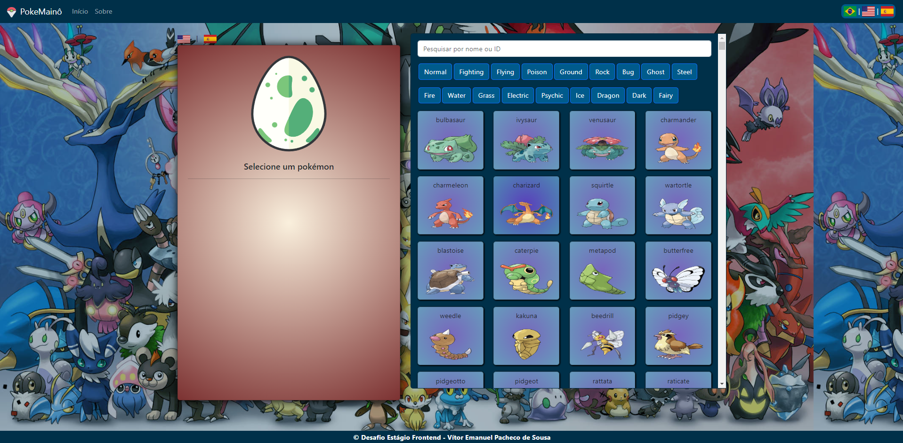

# Seja bem-vindo à minha Pokédex

Neste projeto, realizo o consumo da pokeapi.co e criação de uma Pokédex com filtro para busca por nome, ID ou espécie dos pokémons. Também conta com suporte para Inglês e Espanhol (será necessário clicar no idioma desejado e selecionar novamente o pokémon para carregar)

## Vercel: https://desafio-estagio-maino.vercel.app/

## Stack utilizada

**Front-end:** HTML, CSS, Javascript, Vue.js
